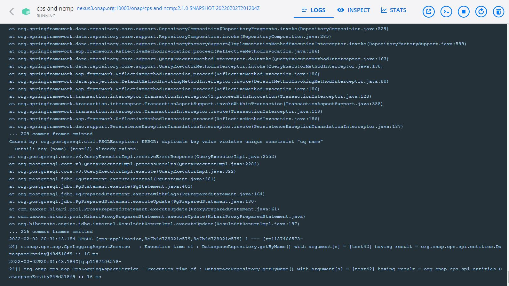

.. This work is licensed under a Creative Commons Attribution 4.0 International License.
.. http://creativecommons.org/licenses/by/4.0
.. Copyright (C) 2021-2025 Nordix Foundation

.. DO NOT CHANGE THIS LABEL FOR RELEASE NOTES - EVEN THOUGH IT GIVES A WARNING
.. _adminGuide:

CPS Admin Guide
###############

.. toctree::
   :maxdepth: 1

Regular Maintenance
===================
This section details tasks that an administrator of the CPS application should execute on regular basis
to ensure optimum working of CPS.

Dataspace Clean Up
------------------
Certain data in the CPS database might not be explicitly removed after it is no longer required ('orphaned data').
For example, schema sets and their associated unique module resources no longer used by any anchor because of model upgrades.
This data would unnecessarily take up space and could eventually affect the performance of the DB if it is not deleted.
How often this needs to be done depends on how often schema sets are being deprecated.
Typically once per month should suffice.

To remove orphaned data in a given dataspace use the following post request:

.. code::

    http://<cps-component-service-name>:<cps-port>/v2/admin/dataspaces/<dataspace-name>/actions/clean

for example

.. code-block:: bash

    curl --location --request POST 'http://cps:8080/admin/datsaspaces/bookstore/actions/clean' \
    --header 'Content-Type: application/json; charset=utf-8'

    Response : HTTP Status 204

For more details refer to the CPS-Core API:  :doc:`design`.

.. note::
   NCMP has no specific maintenance tasks but it will also build up orphaned data when CM Handles get updated and or deleted.
   To delete this data execute the above procedure for the dataspace named 'NFP-Operational'.

Logging Configuration
=====================

.. note::
   Default logging level of "logging.level.org.onap.cps" is set to "INFO".

.. code-block:: bash

   logging:
    level:
        org:
            springframework: INFO
            onap:
                cps: INFO

CPS Log pattern
---------------

.. code-block::

   <pattern>
       {
         "logTimeStamp" : "%timestamp", // 2022-01-28 18:39:17.768
         "logLevel": "%level",   // DEBUG
         "principalId": "%userId",    // cpsuser
         "serviceName": "${springAppName}",  // cps-application
         "message":"%message",  // Execution time ...
         "processId": "${PID}", //11128
         "threadName": "%thread", //tp1901272535-29
         "class": "%logger{40}", .// o.onap.cps.aop.CpsLoggingAspectService
       }
   </pattern>

Change logging level
--------------------

- Curl command 1. Check current log level of "logging.level.org.onap.cps" if it is set to it's default value (INFO)

.. code-block:: bash

    curl --location --request GET 'http://{cps-service-name:cps-port}/actuator/loggers/org.onap.cps' \
    --header 'Content-Type: application/json; charset=utf-8'

    Response body : HTTP Status 200

    {
        "configuredLevel": "INFO",
        "effectiveLevel": "INFO"
    }

- Curl command 2. Change logging level of "logging.level.org.onap.cps" to "DEBUG"

.. note::
   Below-mentioned endpoint  will change the log level at runtime. After executing the curl command "effectiveLevel" will set and applied immediately without restarting CPS service.

.. code-block:: bash

    curl --location --request POST 'http://{cps-service-name:cps-port}/actuator/loggers/org.onap.cps' \
    --header 'Content-Type: application/json; charset=utf-8' \
    --data-raw '{
                    "configuredLevel": "DEBUG"
                }'

    Response body : HTTP Status 204

- Curl command 3. Verify if log level of "logging.level.org.onap.cps" is changed from 'INFO' to 'DEBUG'

.. code-block:: bash

    curl --location --request GET 'http://{cps-service-name:cps-port}/actuator/loggers/org.onap.cps' \
    --header 'Content-Type: application/json; charset=utf-8'

    Response body : HTTP Status 200

    {
    "configuredLevel": "DEBUG",
    "effectiveLevel": "DEBUG"
    }

Location of log files
---------------------
By default, Spring Boot will only log to the console and will not write log files.

Measure Execution Time of CPS Service
-------------------------------------

.. note::
   Make sure effective log level of "logging.level.org.onap.cps" is 'DEBUG'. This can be verified by executing curl command 3.

Execute CPS service that you want to calculate total elapsed time and log as shown below

.. code-block::

   2022-01-28 18:39:17.679 DEBUG [cps-application,e17da1571e518c59,e17da1571e518c59] 11128 --- [tp1901272535-29] o.onap.cps.aop.CpsLoggingAspectService   : Execution time of : DataspaceRepository.getByName() with argument[s] = [test42] having result = org.onap.cps.impl.models.DataspaceEntity@68ded236 :: 205 ms

   2022-01-28 18:39:17.726 DEBUG [cps-application,e17da1571e518c59,e17da1571e518c59] 11128 --- [tp1901272535-29] o.onap.cps.aop.CpsLoggingAspectService   : Execution time of : AnchorRepository.getByDataspaceAndName() with argument[s] = [org.onap.cps.impl.models.DataspaceEntity@68ded236, bookstore] having result = org.onap.cps.impl.models.AnchorEntity@71c47fb1 :: 46 ms

   2022-01-28 18:39:17.768 DEBUG [cps-application,e17da1571e518c59,e17da1571e518c59] 11128 --- [tp1901272535-29] o.onap.cps.aop.CpsLoggingAspectService   : Execution time of : CpsAdminPersistenceServiceImpl.getAnchor() with argument[s] = [test42, bookstore] having result = Anchor(name=bookstore, dataspaceName=test42, schemaSetName=bookstore) :: 299 ms

   2022-01-28 18:39:17.768 DEBUG [cps-application,e17da1571e518c59,e17da1571e518c59] 11128 --- [tp1901272535-29] o.onap.cps.aop.CpsLoggingAspectService   : Execution time of : CpsAdminServiceImpl.getAnchor() with argument[s] = [test42, bookstore] having result = Anchor(name=bookstore, dataspaceName=test42, schemaSetName=bookstore) :: 305 ms

   2022-01-28 18:39:17.843 DEBUG [cps-application,e17da1571e518c59,e17da1571e518c59] 11128 --- [tp1901272535-29] o.onap.cps.aop.CpsLoggingAspectService   : Execution time of : AdminRestController.getAnchor() with argument[s] = [test42, bookstore] having result = <200 OK OK,class AnchorDetails {
    name: bookstore
    dataspaceName: test42
    schemaSetName: bookstore
   },[]> :: 419 ms

.. warning::
   Revert logging level of "logging.level.org.onap.cps" to 'INFO' again to prevent unnecessary logging and impacts on performance.

.. Below Label is used by documentation for other CPS components to link here, do not remove even if it gives a warning
.. _cps_common_logging:

Logging & Diagnostics
=====================

General Guidelines
------------------

CPS-Core logs are sent to `STDOUT` in order to leverage the Kubernetes logging architecture.

These logs are available using the following command:

.. code:: bash

    kubectl logs <cps-core-pod>

The default configuration for CPS logs is the INFO level.

This architecture also makes all logs ready to be sent to an Elastic-search Log-stash and Kibana (ELK) stack or similar.

Enabling tracing for all executed sql statements is done by changing hibernate
loggers log level

Logger configuration is provided as a chart resource :

    +--------------------------------+-----------------------------------------------------------------------------------------------------------------------------------------------+
    | cps-component-service-name     | logback.xml location                                                                                                                          |
    +================================+===============================================================================================================================================+
    | cps-core                       | `logback-spring.xml <https://github.com/onap/oom/blob/master/kubernetes/cps/components/cps-core/resources/config/logback-spring.xml>`__       |
    +--------------------------------+-----------------------------------------------------------------------------------------------------------------------------------------------+
    | ncmp-dmi-plugin                | Not yet applicable to DMI-Plugin                                                                                                              |
    +--------------------------------+-----------------------------------------------------------------------------------------------------------------------------------------------+

.. Below Label is used by documentation for other CPS components to link here, do not remove even if it gives a warning
.. _cps_common_monitoring:

Monitoring
==========
Once CPS-Core is deployed, information related to the running instance of the application is available

.. code::

    http://<cps-component-service-name>:8080/actuator/info/

Health
------

Cps-Core health status and state can be checked using the following endpoint.
This also includes both the liveliness state and readiness state.

.. code::

    http://<cps-component-service-name>:8080/actuator/health/

Metrics
-------

Prometheus Metrics can be checked at the following endpoint

.. code::

    http://<cps-component-service-name>:8080/actuator/prometheus

Hazelcast
---------

Hazelcast cluster state and health check can be seen using the below endpoints

.. code::

    http://<cps-component-service-name>:<member-port>/hazelcast/health
    http://<cps-component-service-name>:<member-port>/hazelcast/rest/management/cluster/state

See also : :ref:`cps_common_distributed_datastructures`

Naming Validation
-----------------

As part of the Kohn 3.1.0 release, CPS has added validation to the names of the following components:

    - Dataspace names
    - Anchor names
    - CM Handle identifiers

The following characters along with spaces are no longer valid for naming of these components.

.. code::

    !"#$%&'()*+,./\:;<=>?@[]^`{|}~
