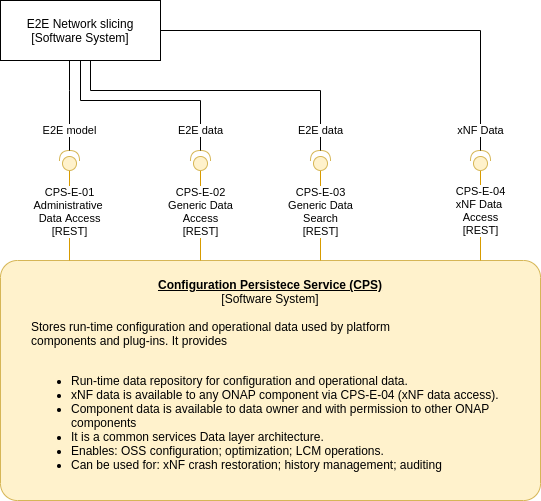

.. This work is licensed under a Creative Commons Attribution 4.0 International License.
.. http://creativecommons.org/licenses/by/4.0
.. Copyright (C) 2021 Nordix Foundation, Pantheon.tech
.. _architecture:

CPS Architecture
################

.. toctree::
   :maxdepth: 1

High Level Component Definition and Architectural Relationships
===============================================================

The Configuration Persistence Service (CPS) provides storage for run-time configuration and operational
parameters that need to be used by ONAP.

In this release the CPS is a stand-alone component. Project page describing eventual scope and ambition is here:
`Configuration Persistence Service Project <https://wiki.onap.org/display/DW/Configuration+Persistence+Service+Project>`_ 

This page reflects the state for Honolulu-R8 release.

API definitions
===============

Configuration Persistence Service provides following interfaces.

.. list-table::
   :header-rows: 1

   * - Interface name
     - Interface definition
     - Interface capabilities
     - Protocol
   * - CPS-E-01
     - Administrative Data Management
     - - create/delete dataspace
       - create/delete schema set
       - create/delete anchor
     - REST
   * - CPS-E-02
     - Generic Data Access
     - - create data node
       - read data node by xpath with or without descendants
       - update data node by xpath with or without descendants
     - REST
   * - CPS-E-03
     - Generic Data Search
     - - query data nodes by xpath prefix and attribute value
     - REST
   * - CPS-E-04
     - Change Notification
     - *Not available in Honolulu-R8*
     - *N/A*
   * - CPS-E-05
     - xNF Data Access
     - - read xNF data
       - query xNF data
     - REST

The CPS Basic Concepts are described in :doc:`modeling`.
