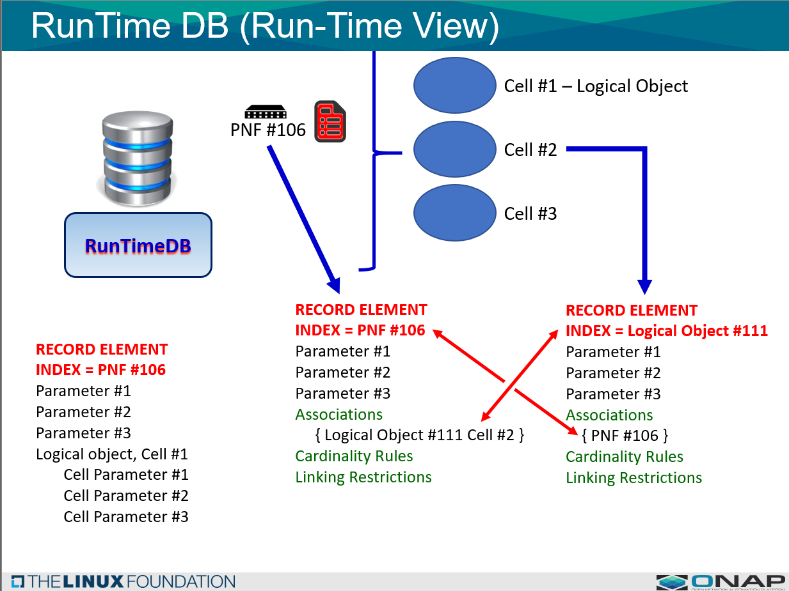
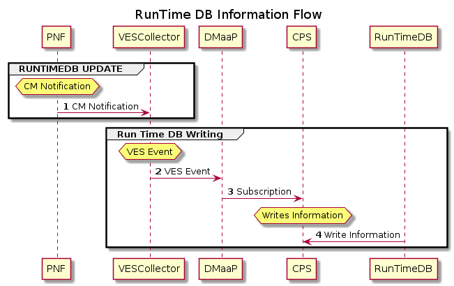
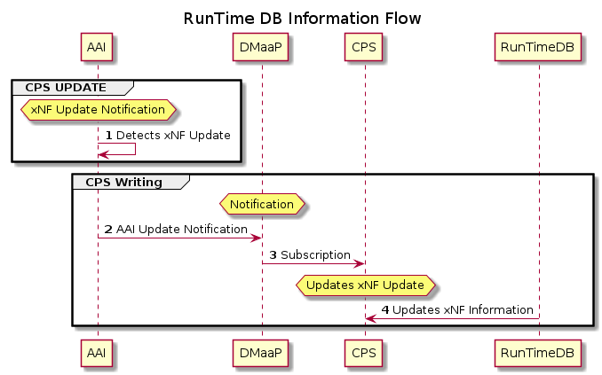

..  Copyright (C) 2021 Nordix Foundation
.. _architecture:

CPS in ONAP Architecture
--------------------------

The Configuration Persistence Service is a platform component that is designed to serve as a data repository for Run time data that needs to be persistent. It is characterized by the following purpose statements:

REPOSITORY -  The types of data that is stored in the Run-Time data storage repository for:
**********

(1) CONFIGURATION PARAMETERS - These are configuration parameters that are used by xNFs during installation & commissioning. Configuration parameters are typically used before the xNF has been brought up or is operational. For example, a 5G Network configuration parameter for a PNFs that sets the mechanical tilt which is a configuration setting upon installation.
(2) OPERATIONAL PARAMETERS - These are parameters that are derived, discovered, computed that are used by xNFs during run time AFTER the xNF becomes operational i.e. AFTER it has "booted up", been installed, configure. For example, in 5G Network, 5G PNFs may need to adjust a tower electrical antenna tilt. These operational parameters are Exo-inventory information, meaning it is information that doesn't belong in A&AI. In principle, some parameters might be both configuration and operational parameters depending on how they are used.
(3) POLICY INFORMATION - This type of information stores policy information that micro-services might need.
(4) APPLICATION INFORMATION - Information related to operational parameter.

DATA LAKE - Architecturally, the Configuration Persistence Service is designed to be a common services data layer which can serve as a data lake to other run time entities (ONAP components or external tools).
**********

C&PS FUNCTIONS - The Configuration Persistence Service enables functionality to be performed by other entities. It will ENABLE the capability of another components or external tools within/or external to ONAP to perform the functions.
***************

**Configuration Management FUNCTIONS** - Enables OSS configuration, optimization, and LCM operations.

**SYNCING** - The Configuration Persistence Service enables the ability to sync data between initial and delta changes ONAP & the xNFs.

**DATA RECOVERY** - It will allow for the recovery of data once a source of truth is defined.

**UPDATES** - It will allow for updates, delta changes, and incremental updates to be performed.

RESTORATION** - It will allow for the recovery and restoration of data to a fall back point.

**DATA HISTORY** - It will allow an operator to see a history of changes in data. This will includes the versioning of the data, which is also associated with updates, roll back, restoration. Time series management is associated with data history management.

**AUDITING** - It will allow for auditing of configuration and parameters against a "golden" template. It itself stores & provides the data for another thing to perform the auditing. Consistency checks.

**ROLL BACK** - It will allow for rollback back to "save points" or recovery points.

**ACCESS CONTROL** - A security topic, which allows the definition of policies, of who and what they can update.

**TOPOLOGY TRAVERSAL** - It will enable the ability for something to traverse the relationship between data elements.

**MODEL ADAPTION** - Depending on the schemas used to define the DB data elements; it allows for the adaptation or transformation of models from other sources (e.g. ORAN or 3GPP models).

**CENTRAL/DISTRIBUTED** - Because it is a common service, it is part of an ONAP installation, so it could be deployed with either an Edge ONAP installation or a centralized ONAP installation. The DB shall be designed to accommodate distributed operation as part of its role in the ONAP installation.

OVERVIEW CONFIGURATION PERSISTENCE SERVICE INFORMATION FLOW
###########################################################

Information Flows to CPS or from CPS DB during Run Time Operation of ONAP.

**1 INFORMATION FLOW DATA WRITTEN TO CPS:**

Information Flows show data being written to the CPS

New Information is written to CPS from a Component or a Micro-service

The following three basic flows are described:

FLOW 1: VES Event (CM Notify) Updates - Information flow
FLOW 2: A&AI xNF (create/delete) updates - Information flow
FLOW 3: micro-Service / Controller (SDN-R, SDN-C, APP-C, CC SDK) / other Component Updates for operational information - Information flow

**2 INFORMATION FLOW DATA READ FROM CPS:**

Information Flow from CPS

Other components are reading from CPS.

Taking information from CPS and using it to send to xNF components

FLOW 4: Data is read from CPS
Race Conditions - a hysteresis (a time difference) between writing information (from a Kafka broker) and a read request arriving before the writing has finished.

RUNTIME CONFIG DB DATABASE & STRUCTURE
######################################

DATA STRUCTURE (ONBOARDING & DESIGN TIME)
****************************************
A data structure which is common for all different vendor xNFs will be used for the CPS.
Domain oriented components can be used where all of those components share common information.
Any micro-service or ONAP platform component can define information in the data structure.
Before Run Time, the CPS is setup with the appropriate data structures that it needs to work from SDC CSAR Service definition file package.
The Run Time Config is schema for the records CPS are defined in advance. In the future (later releases) the RunTime Config DB schema may defined data structures on the fly.
Topology-type can be represented through the xNF associations in the schema
DESIGN TIME - The schema of data structure of RECORDS the run Time Config DB can support are created and defined in advance.
RUN TIME - During Run Time the data and associations are DYNAMICALLY Run Time config DB updated using the schema of the records.

|cps-runtime-db|

CONFIGURATION PERSISTENCE SERVICE DATA LAYER
######################################

The CPS is a Data layer common service data lake.
There has been quite a bit of discussion related to how to architect the RunTime DB component.
In R6 is was determined, that it should be a common service as a data layer to other ONAP components.

|CPS-RunTime-DB-ONAP-Component|

Information Flow
*****************
These four flows show the usage of CPS

FLOW 1: VES Event Updates (CM Notify) - Information flow
FLOW 2: A&AI xNF (create/delete) updates - Information flow
FLOW 3: micro-Service / Controller / Component Updates for operational information - Information flow
FLOW 4: Data is read from CPS

|information-flow|

xNF Addition/Delete A&AI Update Flow - Updates to CPS
*******************************************************

The following UML diagram shows the xNF Update flow from updates in A&AI for CPS
In this flow, A&AI has determined that a xNF (PNF or VNF) has been removed or added to the network.
And so downstream dependent components need to update their information that a xNF has been removed/added.
In the case of RunTime, there would be a record for that xNF and it would be need to be removed/added
the basic mechanism of how this is done is reused (nothing new is introduced): A&AI publishes an notify event on DMaaP bus,
and RunTime (component) subscribes to that event and updates itself.

|A&AI-flow|

mS/Controller Operational Info Update Flow - Writing to CPS
***********************************************************

The following UML diagram shows Where another ONAP component or Micro-Service updates CPS

|update-component|

.. |update-component| image:: image/architecture/CPS-RunTime-ONAP-Component-Update-Flow.png
