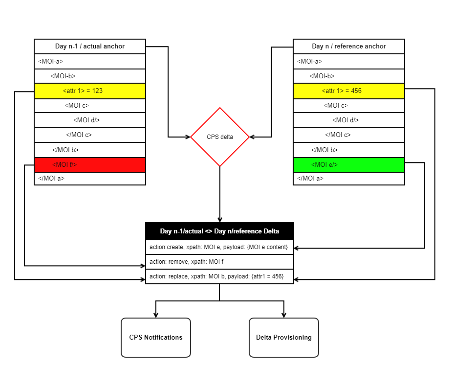

.. This work is licensed under a Creative Commons Attribution 4.0 International License.
.. http://creativecommons.org/licenses/by/4.0
.. Copyright (C) 2021 Pantheon.tech
.. Copyright (C) 2024 TechMahindra Ltd.
.. _cpsDelta:

.. toctree::
   :maxdepth: 1

CPS Delta Feature
#################

- The concept of CPS Delta Feature is to have the ability to find the delta or difference between two configurations stored in CPS DB.

- The Delta feature brings a new functionality:

    - Ability to find the delta between the configurations stored in two anchors within the same dataspace.

The calculated differences can then be used to generate a Delta Report which can be sent over the Kafka Notification Service to the user.

Delta Report Format
-------------------

The Delta Report is based on the RFC 9144, which defines a set of parameters to be included in the Delta Report. In CPS only the relevant parameters defined in RFC 9144 are used. These include:
    - **action:** This parameter defines how the data nodes changed between two configurations. If data nodes are added, deleted or modified then the 'action' parameter in the delta report will be set to ADD, DELETE or UPDATE respectively for each data node.
    - **xpath:** This parameter will provide the xpath of each data node that has been either added, deleted or modified.
    - **source-data:** this parameter is added to the delta report when a data node is deleted or updated, this represents the source/reference data against which the delta is being generated. In case of newly added data node this field is not included in the delta report.
    - **target-data:** this parameter is added to the delta report when a data node is added or updated, this represents the data values that are being compared to the source data. In case of a data node being deleted this field is not included in the delta report.

**Note.** In case of an existing data node being modified, both the source-data and target-data fields are present in the delta report.

Mechanism for Delta generation
------------------------------

Endpoints provided as part of Delta Feature
-------------------------------------------

.. toctree::
   :maxdepth: 1

   cps-delta-endpoints.rst