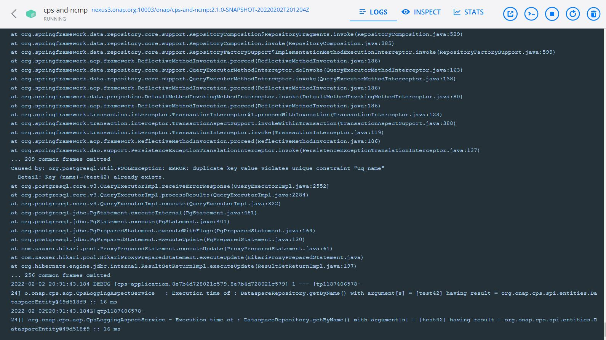

.. This work is licensed under a Creative Commons Attribution 4.0 International License.
.. http://creativecommons.org/licenses/by/4.0
.. Copyright (C) 2021 Nordix Foundation
.. Modifications Copyright (C) 2021 Bell Canada.

.. DO NOT CHANGE THIS LABEL FOR RELEASE NOTES - EVEN THOUGH IT GIVES A WARNING
.. _deployment:

CPS Deployment
==============

.. contents::
    :depth: 2

CPS OOM Charts
--------------
The CPS kubernetes chart is located in the `OOM repository <https://github.com/onap/oom/tree/master/kubernetes/cps>`_.
This chart includes different cps components referred as <cps-component-name> further in the document are listed below:

.. container:: ulist

  - `cps-core <https://github.com/onap/oom/tree/master/kubernetes/cps/components/cps-core>`_
  - `cps-temporal <https://github.com/onap/oom/tree/master/kubernetes/cps/components/cps-temporal>`_
  - `ncmp-dmi-plugin <https://github.com/onap/oom/tree/master/kubernetes/cps/components/ncmp-dmi-plugin>`_

Please refer to the `OOM documentation <https://docs.onap.org/projects/onap-oom/en/latest/oom_user_guide.html>`_ on how to install and deploy ONAP.

Installing or Upgrading CPS Components
--------------------------------------
The assumption is you have cloned the charts from the OOM repository into a local directory.

**Step 1** Go to the cps charts and edit properties in values.yaml files to make any changes to particular cps component if required.

.. code-block:: bash

  cd oom/kubernetes/cps/components/<cps-component-name>

**Step 2** Build the charts

.. code-block:: bash

  cd oom/kubernetes
  make SKIP_LINT=TRUE cps

.. note::
   SKIP_LINT is only to reduce the "make" time

**Step 3** Undeploying already deployed cps components

After undeploying cps components, keep monitoring the cps pods until they go away.

.. code-block:: bash

  helm del --purge <my-helm-release>-<cps-component-name>
  kubectl get pods -n <namespace> | grep <cps-component-name>

**Step 4** Make sure there is no orphan database persistent volume or claim.

First, find if there is an orphan database PV or PVC with the following commands:

.. note::
   This step does not apply to ncmp-dmi-plugin.

.. code-block:: bash

  kubectl get pvc -n <namespace> | grep <cps-component-name>
  kubectl get pv -n <namespace> | grep <cps-component-name>

If there are any orphan resources, delete them with

.. code-block:: bash

    kubectl delete pvc <orphan-cps-core-pvc-name>
    kubectl delete pv <orphan-cps-core-pv-name>

**Step 5** Delete NFS persisted data for CPS components

Connect to the machine where the file system is persisted and then execute the below command

.. code-block:: bash

  rm -fr /dockerdata-nfs/<my-helm-release>/<cps-component-name>

**Step 6** Re-Deploy cps pods

After deploying cps, keep monitoring the cps pods until they come up.

.. code-block:: bash

  helm deploy <my-helm-release> local/cps --namespace <namespace>
  kubectl get pods -n <namespace> | grep <cps-component-name>

Restarting a faulty component
-----------------------------
Each cps component can be restarted independently by issuing the following command:

.. code-block:: bash

    kubectl delete pod <cps-component-pod-name> -n <namespace>

.. Below Label is used by documentation for other CPS components to link here, do not remove even if it gives a warning
.. _cps_common_credentials_retrieval:

Credentials Retrieval
---------------------

Application and database credentials are kept in Kubernetes secrets. They are defined as external secrets in the
values.yaml file to be used across different components as :

.. container:: ulist

  - `cps-core <https://github.com/onap/oom/blob/master/kubernetes/cps/components/cps-core/values.yaml#L18>`_
  - `cps-temporal <https://github.com/onap/oom/blob/master/kubernetes/cps/components/cps-temporal/values.yaml#L28>`_
  - `ncmp-dmi-plugin <https://github.com/onap/oom/blob/master/kubernetes/cps/components/ncmp-dmi-plugin/values.yaml#L22>`_

Below are the list of secrets for different cps components.

+--------------------------+---------------------------------+---------------------------------------------------+
| Component                | Secret type                     | Secret Name                                       |
+==========================+=================================+===================================================+
| cps-core                 | Database authentication         | <my-helm-release>-cps-core-pg-user-creds          |
+--------------------------+---------------------------------+---------------------------------------------------+
| cps-core                 | Rest API Authentication         | <my-helm-release>-cps-core-app-user-creds         |
+--------------------------+---------------------------------+---------------------------------------------------+
| cps-temporal             | Rest API Authentication         | <my-helm-release>-cps-temporal-app-user-creds     |
+--------------------------+---------------------------------+---------------------------------------------------+
| cps-temporal             | Database authentication         | <my-helm-release>-cps-temporal-pg-user-creds      |
+--------------------------+---------------------------------+---------------------------------------------------+
| ncmp-dmi-plugin          | Rest API Authentication         | <my-helm-release>-cps-dmi-plugin-user-creds       |
+--------------------------+---------------------------------+---------------------------------------------------+
| ncmp-dmi-plugin          | SDNC authentication             | <my-helm-release>-ncmp-dmi-plugin-sdnc-creds      |
+--------------------------+---------------------------------+---------------------------------------------------+

The credential values from these secrets are configured in running container as environment variables. Eg:
`cps core deployment.yaml <https://github.com/onap/oom/blob/master/kubernetes/cps/components/cps-core/templates/deployment.yaml#L46>`_

If no specific passwords are provided to the chart as override values for deployment, then passwords are automatically
generated when deploying the Helm release. Below command can be used to retrieve application property credentials

.. code::

  kubectl get secret <my-helm-release>-<secret-name> -n <namespace> -o json | jq '.data | map_values(@base64d)'

.. note::
   base64d works only with jq version 1.6 or above.

CPS Core Pods
=============
To get a listing of the cps-core Pods, run the following command:

.. code-block:: bash

  kubectl get pods -n <namespace> | grep cps-core

  dev-cps-core-ccd4cc956-r98pv                          1/1     Running            0          24h
  dev-cps-core-postgres-primary-f7766d46c-s9d5b         1/1     Running            0          24h
  dev-cps-core-postgres-replica-84659d68f9-6qnt4        1/1     Running            0          24h


Additional Cps-Core Customizations
==================================

The following table lists some properties that can be specified as Helm chart
values to configure the application to be deployed. This list is not
exhaustive.

+---------------------------------------+---------------------------------------------------------------------------------------------------------+-------------------------------+
| Property                              | Description                                                                                             | Default Value                 |
+=======================================+=========================================================================================================+===============================+
| config.appUserName                    | User name used by cps-core service to configure the authentication for REST API it exposes.             | ``cpsuser``                   |
|                                       |                                                                                                         |                               |
|                                       | This is the user name to be used by cps-core REST clients to authenticate themselves.                   |                               |
+---------------------------------------+---------------------------------------------------------------------------------------------------------+-------------------------------+
| config.appUserPassword                | Password used by cps-core service to configure the authentication for REST API it exposes.              | Not defined                   |
|                                       |                                                                                                         |                               |
|                                       | This is the password to be used by CPS Temporal REST clients to authenticate themselves.                |                               |
|                                       |                                                                                                         |                               |
|                                       | If not defined, the password is generated when deploying the application.                               |                               |
|                                       |                                                                                                         |                               |
|                                       | See also :ref:`cps_common_credentials_retrieval`.                                                       |                               |
+---------------------------------------+---------------------------------------------------------------------------------------------------------+-------------------------------+
| config.dmiPluginUserName              | User name used by cps-core to authenticate themselves for using ncmp-dmi-plugin service.                | ``dmiuser``                   |
+---------------------------------------+---------------------------------------------------------------------------------------------------------+-------------------------------+
| config.dmiPluginUserPassword          | Internal password used by cps-core to connect to ncmp-dmi-plugin service.                               | Not defined                   |
|                                       |                                                                                                         |                               |
|                                       | If not defined, the password is generated when deploying the application.                               |                               |
|                                       |                                                                                                         |                               |
|                                       | See also :ref:`cps_common_credentials_retrieval`.                                                       |                               |
+---------------------------------------+---------------------------------------------------------------------------------------------------------+-------------------------------+
| postgres.config.pgUserName            | Internal user name used by cps-core to connect to its own database.                                     | ``cps``                       |
+---------------------------------------+---------------------------------------------------------------------------------------------------------+-------------------------------+
| postgres.config.pgUserPassword        | Internal password used by cps-core to connect to its own database.                                      | Not defined                   |
|                                       |                                                                                                         |                               |
|                                       | If not defined, the password is generated when deploying the application.                               |                               |
|                                       |                                                                                                         |                               |
|                                       | See also :ref:`cps_common_credentials_retrieval`.                                                       |                               |
+---------------------------------------+---------------------------------------------------------------------------------------------------------+-------------------------------+
| postgres.config.pgDatabase            | Database name used by cps-core                                                                          | ``cpsdb``                     |
|                                       |                                                                                                         |                               |
+---------------------------------------+---------------------------------------------------------------------------------------------------------+-------------------------------+
| logging.level                         | Logging level set in cps-core                                                                           | info                          |
|                                       |                                                                                                         |                               |
+---------------------------------------+---------------------------------------------------------------------------------------------------------+-------------------------------+
| config.eventPublisher.                | Kafka hostname and port                                                                                 | ``message-router-kafka:9092`` |
| spring.kafka.bootstrap-servers        |                                                                                                         |                               |
+---------------------------------------+---------------------------------------------------------------------------------------------------------+-------------------------------+
| config.eventPublisher.                | Kafka consumer client id                                                                                | ``cps-core``                  |
| spring.kafka.consumer.client-id       |                                                                                                         |                               |
+---------------------------------------+---------------------------------------------------------------------------------------------------------+-------------------------------+
| config.publisher.                     | Kafka security protocol.                                                                                | ``PLAINTEXT``                 |
| spring.kafka.security.protocol        | Some possible values are:                                                                               |                               |
|                                       |                                                                                                         |                               |
|                                       | * ``PLAINTEXT``                                                                                         |                               |
|                                       | * ``SASL_PLAINTEXT``, for authentication                                                                |                               |
|                                       | * ``SASL_SSL``, for authentication and encryption                                                       |                               |
+---------------------------------------+---------------------------------------------------------------------------------------------------------+-------------------------------+
| config.publisher.                     | Kafka security SASL mechanism. Required for SASL_PLAINTEXT and SASL_SSL protocols.                      | Not defined                   |
| spring.kafka.properties.              | Some possible values are:                                                                               |                               |
| sasl.mechanism                        |                                                                                                         |                               |
|                                       | * ``PLAIN``, for PLAINTEXT                                                                              |                               |
|                                       | * ``SCRAM-SHA-512``, for SSL                                                                            |                               |
+---------------------------------------+---------------------------------------------------------------------------------------------------------+-------------------------------+
| config.publisher.                     | Kafka security SASL JAAS configuration. Required for SASL_PLAINTEXT and SASL_SSL protocols.             | Not defined                   |
| spring.kafka.properties.              | Some possible values are:                                                                               |                               |
| sasl.jaas.config                      |                                                                                                         |                               |
|                                       | * ``org.apache.kafka.common.security.plain.PlainLoginModule required username="..." password="...";``,  |                               |
|                                       |   for PLAINTEXT                                                                                         |                               |
|                                       | * ``org.apache.kafka.common.security.scram.ScramLoginModule required username="..." password="...";``,  |                               |
|                                       |   for SSL                                                                                               |                               |
+---------------------------------------+---------------------------------------------------------------------------------------------------------+-------------------------------+
| config.publisher.                     | Kafka security SASL SSL store type. Required for SASL_SSL protocol.                                     | Not defined                   |
| spring.kafka.ssl.trust-store-type     | Some possible values are:                                                                               |                               |
|                                       |                                                                                                         |                               |
|                                       | * ``JKS``                                                                                               |                               |
+---------------------------------------+---------------------------------------------------------------------------------------------------------+-------------------------------+
| config.publisher.                     | Kafka security SASL SSL store file location. Required for SASL_SSL protocol.                            | Not defined                   |
| spring.kafka.ssl.trust-store-location |                                                                                                         |                               |
+---------------------------------------+---------------------------------------------------------------------------------------------------------+-------------------------------+
| config.publisher.                     | Kafka security SASL SSL store password. Required for SASL_SSL protocol.                                 | Not defined                   |
| spring.kafka.ssl.trust-store-password |                                                                                                         |                               |
+---------------------------------------+---------------------------------------------------------------------------------------------------------+-------------------------------+
| config.publisher.                     | Kafka security SASL SSL broker hostname identification verification. Required for SASL_SSL protocol.    | Not defined                   |
| spring.kafka.properties.              | Possible value is:                                                                                      |                               |
| ssl.endpoint.identification.algorithm |                                                                                                         |                               |
|                                       | * ``""``, empty string to disable                                                                       |                               |
+---------------------------------------+---------------------------------------------------------------------------------------------------------+-------------------------------+
| config.additional.                    | Kafka topic to publish to cps-temporal                                                                  | ``cps.data-updated-events``   |
| notification.data-updated.topic       |                                                                                                         |                               |
+---------------------------------------+---------------------------------------------------------------------------------------------------------+-------------------------------+
| config.additional.                    | If notification from cps-core to cps-temporal is enabled or not.                                        | ``true``                      |
| notification.data-updated.enabled     | If this is set to false, then the config.publisher properties could be skipped.                         |                               |
+---------------------------------------+---------------------------------------------------------------------------------------------------------+-------------------------------+
| config.additional.                    | Dataspaces to be enabled for publishing events to cps-temporal                                          | ````                          |
| notification.data-updated.filters.    |                                                                                                         |                               |
| enabled-dataspaces                    |                                                                                                         |                               |
+---------------------------------------+---------------------------------------------------------------------------------------------------------+-------------------------------+
| config.additional.                    | If notifications should be processed in synchronous or asynchronous manner                              | ``false``                     |
| notification.async.enabled            |                                                                                                         |                               |
+---------------------------------------+---------------------------------------------------------------------------------------------------------+-------------------------------+
| config.additional.                    | Core pool size in asynchronous execution of notification.                                               | ``2``                         |
| notification.async.executor.          |                                                                                                         |                               |
| core-pool-size                        |                                                                                                         |                               |
+---------------------------------------+---------------------------------------------------------------------------------------------------------+-------------------------------+
| config.additional.                    | Max pool size in asynchronous execution of notification.                                                | ``1``                         |
| notification.async.executor.          |                                                                                                         |                               |
| max-pool-size                         |                                                                                                         |                               |
+---------------------------------------+---------------------------------------------------------------------------------------------------------+-------------------------------+
| config.additional.                    | Queue Capacity in asynchronous execution of notification.                                               | ``500``                       |
| notification.async.executor.          |                                                                                                         |                               |
| queue-capacity                        |                                                                                                         |                               |
+---------------------------------------+---------------------------------------------------------------------------------------------------------+-------------------------------+
| config.additional.                    | If the executor should wait for the tasks to be completed on shutdown                                   | ``true``                      |
| notification.async.executor.          |                                                                                                         |                               |
| wait-for-tasks-to-complete-on-shutdown|                                                                                                         |                               |
+---------------------------------------+---------------------------------------------------------------------------------------------------------+-------------------------------+
| config.additional.                    | Prefix to be added to the thread name in asynchronous execution of notifications.                       | ``async_``                    |
| notification.async.executor.          |                                                                                                         |                               |
| thread-name-prefix                    |                                                                                                         |                               |
+---------------------------------------+---------------------------------------------------------------------------------------------------------+-------------------------------+

Logging Configuration
=====================

.. note::
   Default logging level of "logging.level.org.onap.cps" is set to "INFO".

.. code-block:: bash

   logging:
    level:
        org:
            springframework: INFO
            onap:
                cps: INFO

Change logging level
----------------------

.. container:: ulist

- Check current log level of "logging.level.org.onap.cps" if it is set to it's default value (INFO)

.. code-block:: java

    curl --location --request GET 'http://{CPS-Service-IP/Host-Name:localhost}:{CPS-actuator-Port:8081}/manage/loggers/org.onap.cps' \
    --header 'Content-Type: application/json; charset=utf-8'

    Response body : HTTP Status 200

    {
        "configuredLevel": "INFO",
        "effectiveLevel": "INFO"
    }

- Change logging level of "logging.level.org.onap.cps" to "DEBUG"

.. note::
   Below-mentioned endpoint  will change the log level on fly/runtime. After executing it effectiveLevel will be working with immediate effect without restarting CPS service.

.. code-block:: java

    curl --location --request POST 'http://{CPS-Service-IP/Host-Name:localhost}:{CPS-actuator-Port:8081}/manage/loggers/org.onap.cps' \
    --header 'Content-Type: application/json; charset=utf-8' \
    --data-raw '{
                    "configuredLevel": "DEBUG"
                }'

    Response body : HTTP Status 204

- Verify if log level of "logging.level.org.onap.cps" is changed from 'INFO' to 'DEBUG'

.. code-block:: java

    curl --location --request GET 'http://{CPS-Service-IP/Host-Name:localhost}:{CPS-actuator-Port:8081}/manage/loggers/org.onap.cps' \
    --header 'Content-Type: application/json; charset=utf-8'

    Response body : HTTP Status 200

    {
    "configuredLevel": "DEBUG",
    "effectiveLevel": "DEBUG"
    }

Location of log files
---------------------
By default, Spring Boot will only log to the console and will not write log files.



Measure Execution Time of CPS Service
-------------------------------------

#############################
1. CPS Log pattern is as below :
#############################

.. code-block:: java

   <pattern>
	   {
	     "timestamp" : "%timestamp", // 2022-01-28 18:39:17.768
	     "severity": "%level",   // DEBUG
	     "service": "${springAppName}",  // cps-application
	     "trace": "${TraceId}", // e17da1571e518c59
	     "span": "${SpanId}", // e17da1571e518c59
	     "pid": "${PID}", //11128
	     "thread": "%thread", //tp1901272535-29
	     "class": "%logger{40}", .// o.onap.cps.aop.CpsLoggingAspectService
	     "rest": "%message" // Execution time ...
	   }
   </pattern>

#######################################################
2. Calculate and Log execution time taken by a CPS service
#######################################################

Execute CPS service that you want to calculate total elapsed time and log as shown below

.. code-block:: xml

   2022-01-28 18:39:17.679 DEBUG [cps-application,e17da1571e518c59,e17da1571e518c59] 11128 --- [tp1901272535-29] o.onap.cps.aop.CpsLoggingAspectService   : Execution time of : DataspaceRepository.getByName() with argument[s] = [test42] having result = org.onap.cps.spi.entities.DataspaceEntity@68ded236 :: 205 ms

   2022-01-28 18:39:17.726 DEBUG [cps-application,e17da1571e518c59,e17da1571e518c59] 11128 --- [tp1901272535-29] o.onap.cps.aop.CpsLoggingAspectService   : Execution time of : AnchorRepository.getByDataspaceAndName() with argument[s] = [org.onap.cps.spi.entities.DataspaceEntity@68ded236, bookstore] having result = org.onap.cps.spi.entities.AnchorEntity@71c47fb1 :: 46 ms

   2022-01-28 18:39:17.768 DEBUG [cps-application,e17da1571e518c59,e17da1571e518c59] 11128 --- [tp1901272535-29] o.onap.cps.aop.CpsLoggingAspectService   : Execution time of : CpsAdminPersistenceServiceImpl.getAnchor() with argument[s] = [test42, bookstore] having result = Anchor(name=bookstore, dataspaceName=test42, schemaSetName=bookstore) :: 299 ms

   2022-01-28 18:39:17.768 DEBUG [cps-application,e17da1571e518c59,e17da1571e518c59] 11128 --- [tp1901272535-29] o.onap.cps.aop.CpsLoggingAspectService   : Execution time of : CpsAdminServiceImpl.getAnchor() with argument[s] = [test42, bookstore] having result = Anchor(name=bookstore, dataspaceName=test42, schemaSetName=bookstore) :: 305 ms

   2022-01-28 18:39:17.843 DEBUG [cps-application,e17da1571e518c59,e17da1571e518c59] 11128 --- [tp1901272535-29] o.onap.cps.aop.CpsLoggingAspectService   : Execution time of : AdminRestController.getAnchor() with argument[s] = [test42, bookstore] having result = <200 OK OK,class AnchorDetails {
    name: bookstore
    dataspaceName: test42
    schemaSetName: bookstore
   },[]> :: 419 ms

.. warning::
   Revert logging level of "logging.level.org.onap.cps" to 'INFO' again.

CPS-Core Docker Installation
============================

CPS-Core can also be installed in a docker environment. Latest `docker-compose <https://github.com/onap/cps/blob/master/docker-compose/docker-compose.yml>`_ is included in the repo to start all the relevant services.
The latest instructions are covered in the `README <https://github.com/onap/cps/blob/master/docker-compose/README.md>`_.
