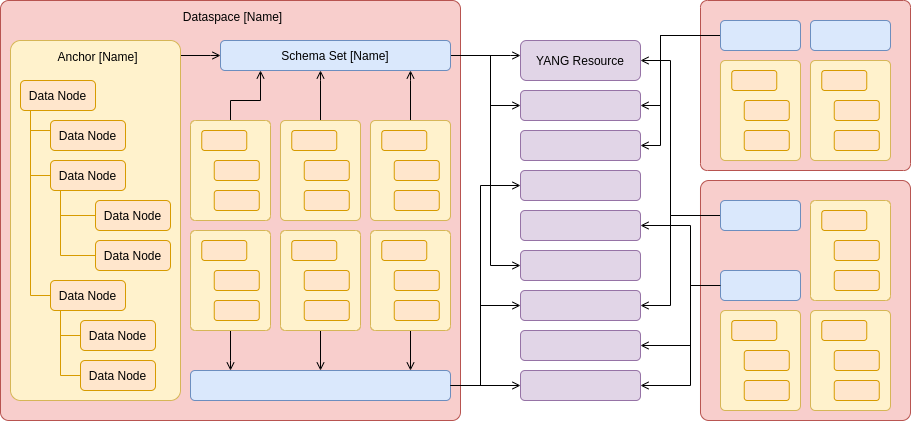

.. This work is licensed under a Creative Commons Attribution 4.0 International License.
.. http://creativecommons.org/licenses/by/4.0
.. Copyright (C) 2021 Pantheon.tech
.. Modifications Copyright (C) 2021-2023 Nordix Foundation
.. _modeling:

.. toctree::
   :maxdepth: 1

CPS Modeling
############

CPS-Core Modeling
=================

Data Model
----------

Basic Concepts
--------------

Administrative entities

- **Dataspace** is a primary logical separation of data.

  Any application can define its own dataspace to store the model(s) and data it owns.
  Dataspace is uniquely identified by it's name.

- **Schema Set** describes a data model(s).

  Schema Set holds reference(s) to single or multiple YANG modules. Schema Set belongs to dataspace
  and uniquely identified by its name (within its own dataspace). Same YANG resources (source files) can be
  referenced by multiple schema sets from different dataspaces.

- **Anchor** identifies the unique data set (data record) within a dataspace.

  Anchor always references a schema set within same dataspace which describes a data model of associated data.
  Multiple anchors may reference same schema set. Anchor is uniquely identified by its name (within own dataspace).

Data

- **Data Node** represents a data fragment.

  Each data node can have zero or more descendants and together they form a data instance tree.
  The data node tree belongs to an anchor.

  Data node is representing a data fragment described in a YANG model as a *container* and/or a *list*.
  The data described as a *leaf* and/or a *leaf-list* are stored within a parent data node.

  The data node position within a tree is uniquely identified by the node's unique **xpath** which can be used
  for partial data query.

Querying

- **CPS Path** is used to query data nodes.

.. toctree::
   :maxdepth: 1

   xpath.rst
   cps-path.rst

Additional information on CPS-Core Interfaces
---------------------------------------------

.. toctree::
   :maxdepth: 1

   cps-delta-feature.rst

.. Below Label is used by documentation for other CPS components to link here, do not remove even if it gives a warning
.. _cps_ncmp_modelling:

NCMP Modeling
=============

Data Model
----------

NCMP stores DMI-Plugin and CM Handle relations using a data model described as per this Yang module.

:download:`DMI Yang Module <api/yang/dmi-registry@2022-05-10.yang>`

Note: Although additional-properties are present in the model of the dmi-registry, these are considered private metadata and as such are not queryable.

Basic Concepts
--------------

- **CM Handle** represents an instance a modeled Network Function(node) in ONAP.

    These are stored as Anchors within CPS-Core.

    - **CM Handle States** are used to represent the potential states in which a CM Handle can transition between.

        The 5 possible CM Handle states are: ADVISED, READY, LOCKED, DELETING, DELETED

        **ADVISED** indicates that a CM Handle has been registered successfully, and is waiting for the module synchronization process to sync the CM Handle.

        **READY** indicates that the CM Handle has been synced successfully.

        **LOCKED** indicates that the CM Handle has not synced successfully. A retry mechanism within CPS will set the state back to ADVISED after a set time.

        **DELETING** indicates that the CM Handle is currently being deleted.

        **DELETED** indicates that the CM Handle has been deleted successfully.

    - **Data-sync state** is the state of the data synchronization process of the CM Handle

        There are 3 possibles states: NONE_REQUESTED, UNSYNCHRONIZED, SYNCHRONIZED

        **NONE_REQUESTED** indicates that the data sync is not requested by the user

        **UNSYNCHRONIZED** indicates the CM Handle is waiting for the data sync watchdog operation to carry out the sync process

        **SYNCHRONIZED** indicates the watchdog process has finished the data synchronization successfully

- **Datastores** represent different views of the cm data.

    Datastores are defined for NCMP to access the CPS running or operational datastores. Currently supported datastores are:

    +--------------------------------+-------------------------------------+-------------------------+
    | Datastore                      | Configurations                      | Data access type        |
    +================================+=====================================+=========================+
    | Passthrough-operational        | config-true, config-false           | read-only               |
    +--------------------------------+-------------------------------------+-------------------------+
    | Passthrough-running            | config-true                         | read-write              |
    +--------------------------------+-------------------------------------+-------------------------+

Additional information on CPS-NCMP interfaces
---------------------------------------------

.. toctree::
   :maxdepth: 1

   ncmp-cmhandle-querying.rst
   ncmp-inventory-querying.rst
   ncmp-data-operation.rst

CPS-NCMP Scheduled Processes
----------------------------

.. toctree::
   :maxdepth: 1

   cps-scheduled-processes.rst
